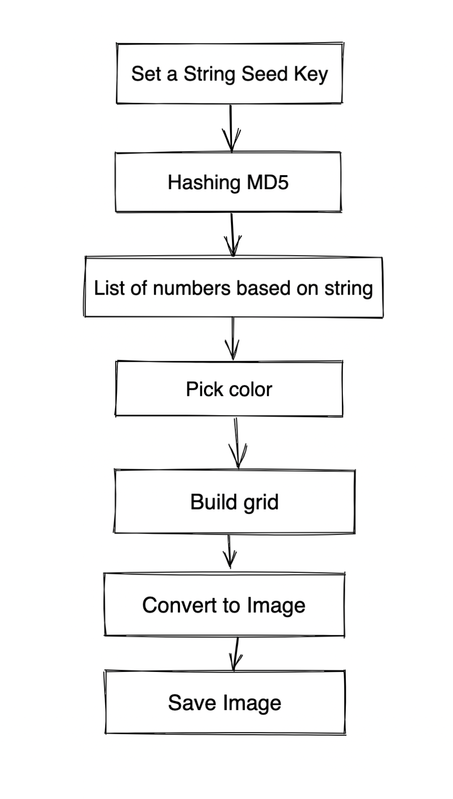

# Identicon

**Description**

Identicon generator written in Elixir.
Create and save 5 x 5 Identicons with a hashed seed.


## Generation Steps



## Setup

Install dependecies:

```mix do deps.get, deps.compile end```


Run mix app:

```iex -S mix```

Run main and pass an input seed as a string:


## Usage:

```
  Identicon.main([input seed])

  e.g:
  # Generate and save the identicon image:
  iex> Identicon.main("seedme")
  
  # to open with your editor make sure to export ELIXIR_EDITOR, e.g:
  # export ELIXIR_EDITOR="my_editor +__LINE__ __FILE__"
  # or if using vscode:
  # export ELIXIR_EDITOR="code --goto"

  # Run open({ path/to/file, line }) in the interactive shell
  iex> open({"seedme.jpg" , 1})
```

Images will be saved in root of the project, with filename as the `input` in `jpg` format.

## Installation
If [available in Hex](https://hex.pm/docs/publish), the package can be installed
by adding `identicon` to your list of dependencies in `mix.exs`:

```elixir
def deps do
  [
    {:identicon, "~> 0.1.0"}
  ]
end
```

Documentation can be generated with [ExDoc](https://github.com/elixir-lang/ex_doc)
and published on [HexDocs](https://hexdocs.pm). Once published, the docs can
be found at <https://hexdocs.pm/identicon>.

